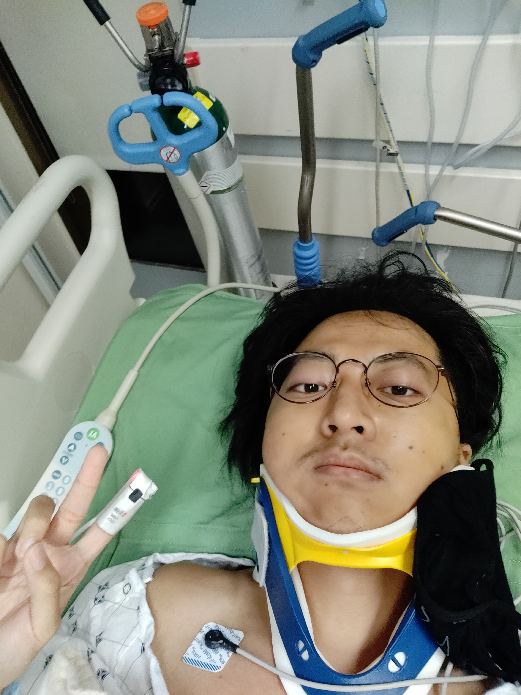
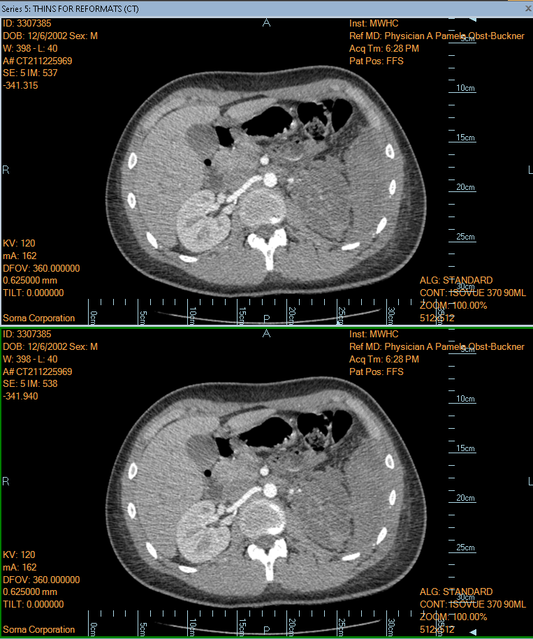

import ImageWrapper from "./ImageWrapper";

I crashed my bike on a wednesday at 6 pm while going to a friend's dorm.

Vision blurred, I woke to a nice lady holding my hand, asking if I was ok and that she had already called 911. At the time all I could think about was [this man running away from an ambulance](https://www.reddit.com/r/LateStageCapitalism/comments/uu26ve/a_man_running_away_from_the_ambulance_because_hes/) because of how expensive they are.

She asked if she could pray for me, and I hesitated. I had to think about it, but I ended up saying yes. The entire time I was on the ground I felt a tightness over my whole body, numbing me from the pain.

Waves of pain crashing down on me as soon as I was loaded on to the ambulance. I was in and out of consciousness, but I remember the sharp pain everytime the ambulance hit a bump on the shitty roads to the hospital.

At the hospital, people draped in white coats surrounded me, asking me questions about who I was, what I was doing, and if I had any allergies all the while changing my clothes and hoisting me onto a bed.

I was wheeled into the operating room for surgery to block the internal bleeding. What was terrifying was that I didn't even notice that I had went under until after the surgery.

<ImageWrapper></ImageWrapper>

One of the worst moments of the hospital stay was when I was told that I had lost my kidney and I had to tell my dad on the phone. This was right after my surgery when I was in the ICU.

I was given a button that when pressed, gave me ketamine (painkiller), and it had a cooldown of 15 minutes. When I pressed it, the nurse told me that I had already pressed it. I was in so much pain that I didn't even notice that I had pressed it. The pain came in waves and it hurt so much that I couldn't even cry.

The rest of the hospital experience was your standard get shot up with pankillers lay in bed doing nothing and eating mediocre hospital food.

Notice how only one of the kidneys is showing up on the ct scan. The other one is swelling and is dark due to lack of bloodflow, which causes it to die.

# one month later

When I left the hospital I had lost over 10lbs and was still super weak in general. Breathing hurt my abdominal area and I had to practice breathing with a spirometer.

The hospital bill also came in. It was $99,000, nearly $100k. I only had to pay $20,000 out of pocket. I was lucky that my parents had a good insurance plan.

# six-ten months later

Honestly at the point I was feeling pretty normal.

Against my parents' wishes, it was the first time getting on a bike since the crash. It was very very scary, and after a mile I was absolutely winded.

# one year later

How do I feel now? I'm not sure, I feel pretty normal now. I haven't really made any life altering health-related changes like I thought I would. I still eat junk food, stay up late sometimes.

I'm back to cycling but I'm still kinda scared of crashing -- especially if I'm going down a hill at 40 mph. I'm not sure if this fear is coming from the crash or from innate fear.

I still don't know how to feel about the accident. I'm not sure if I'm grateful for it or if I'm angry at it. I don't know what long term health effects it will have on me.

# lessons learned

- don't ride shitty bikes
- if safety is a part of the question, just buy the expensive one
- don't be poor when you get injured
